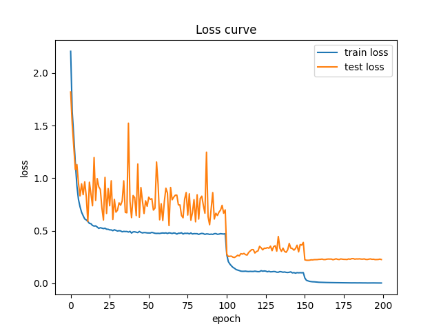
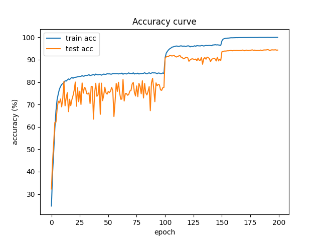
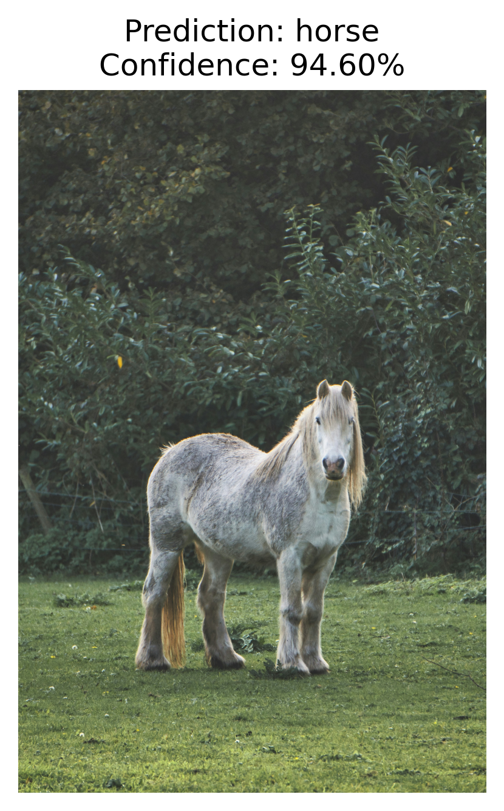
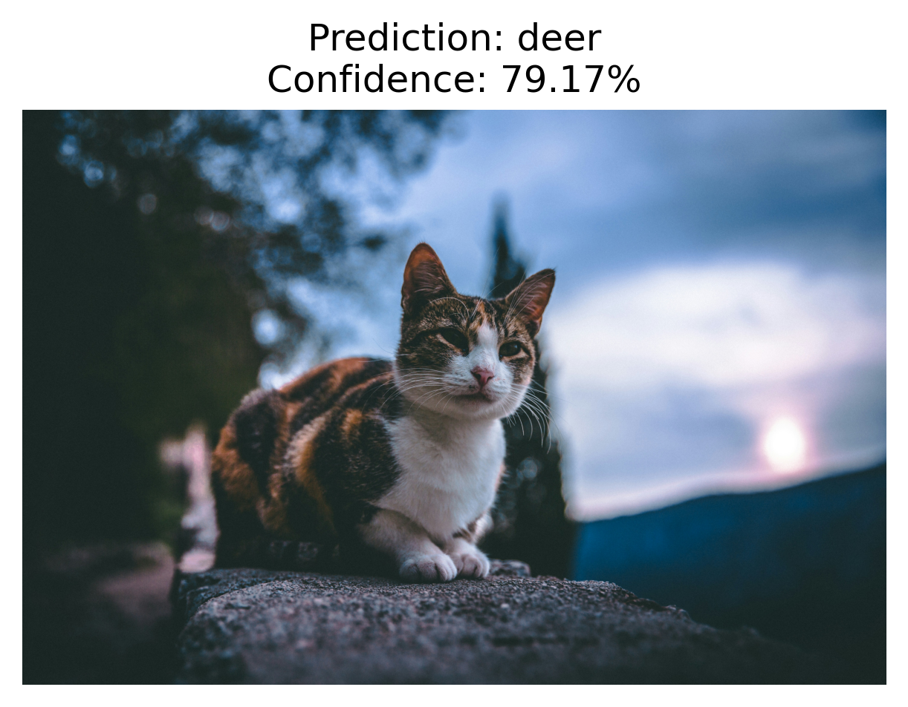
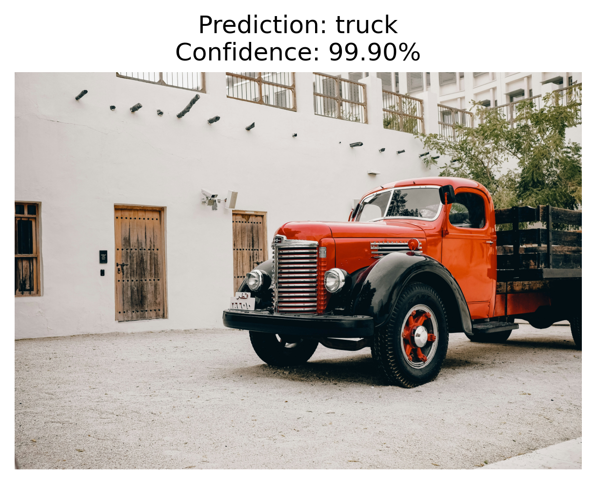
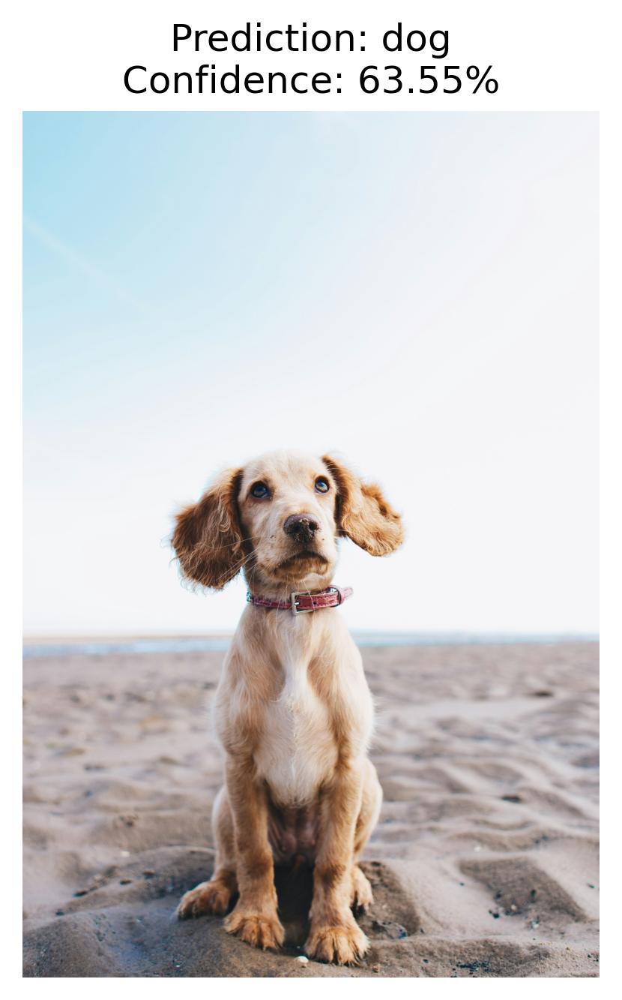
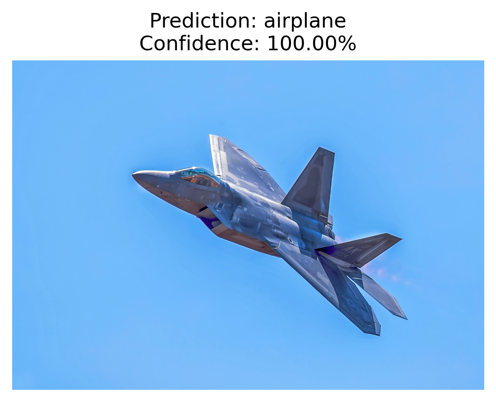

# ResNet18 Image Classification on CIFAR-10

## Project Overview

This project implements an image classification model based on **ResNet18** using the **PyTorch** deep learning framework.

The model is trained on the **CIFAR-10** dataset for image classification. After training, the best model achieves **94.48%** test accuracy. In addition to model training, this project also supports custom image prediction using the trained model.

---

## Project Structure

```text
.
├── data.py                     # Load and preprocess the CIFAR-10 dataset
├── train.py                    # Training process
├── predict.py                  # Custom image prediction
├── main.py                     # Main program
├── README.md
│
├── models/
│   └── resnet.py               # ResNet18 implementation
│
├── weights/
│   └── resnet18_best.pth       # Best trained model
│
├── outputs/
│   ├── loss_curve.png          # Loss curve
│   └── acc_curve.png           # Accuracy curve
│
├── images/                     # Custom test images
│   ├── airplane.jpg
│   ├── cat.jpg
│   ├── dog.jpg
│   ├── horse.jpg
│   └── truck.jpg
│
└── prediction_results/         # Prediction results
    ├── airplane_result.png
    ├── cat_result.png
    ├── dog_result.png
    ├── horse_result.png
    └── truck_result.png
```

---

## Environment

- Python 3.14
- PyTorch
- Google Colab (Tesla T4 GPU)
- GitHub

---

## Dataset

**Dataset:** CIFAR-10

- 60,000 RGB images
- Image size: **32 × 32**
- 10 object categories
- 50,000 training images
- 10,000 testing images

Classes:

```
airplane
automobile
bird
cat
deer
dog
frog
horse
ship
truck
```

---

## Model

**Framework:** PyTorch

**Network:** ResNet18

Training configuration:

| Parameter | Value |
|-----------|-------|
| Loss Function | CrossEntropyLoss |
| Optimizer | SGD |
| Batch Size | 128 |
| Epoch | 200 |
| Initial Learning Rate | 0.2 |

---

## Training Results

Best Test Accuracy:

**94.48%**

### Loss Curve



### Accuracy Curve



---

## Custom Image Prediction

The trained model can predict custom images outside the CIFAR-10 test set.

Run:

```bash
python predict.py
```

Example prediction results:

| Image | Ground Truth | Prediction | Confidence |
|------|--------------|------------|-----------:|
| Horse | Horse | Horse | 94.60% |
| Cat | Cat | Deer | 79.17% |
| Truck | Truck | Truck | 99.90% |
| Dog | Dog | Dog | 63.55% |
| Airplane | Airplane | Airplane | 100.00% |

Example output:

### Horse



### Cat



### Truck



### Dog



### Airplane



---

## How to Run

### Train the model

```bash
python main.py
```

### Predict custom images

Place your own images into the `images/` folder and run:

```bash
python predict.py
```

Prediction results will be automatically saved in:

```text
prediction_results/
```

---

## Project Summary

This project implements the complete workflow of an image classification task using PyTorch, including:

- CIFAR-10 dataset preprocessing
- ResNet18 model implementation
- Model training and evaluation
- Loss and Accuracy visualization
- Custom image prediction
- Automatic saving of prediction results
